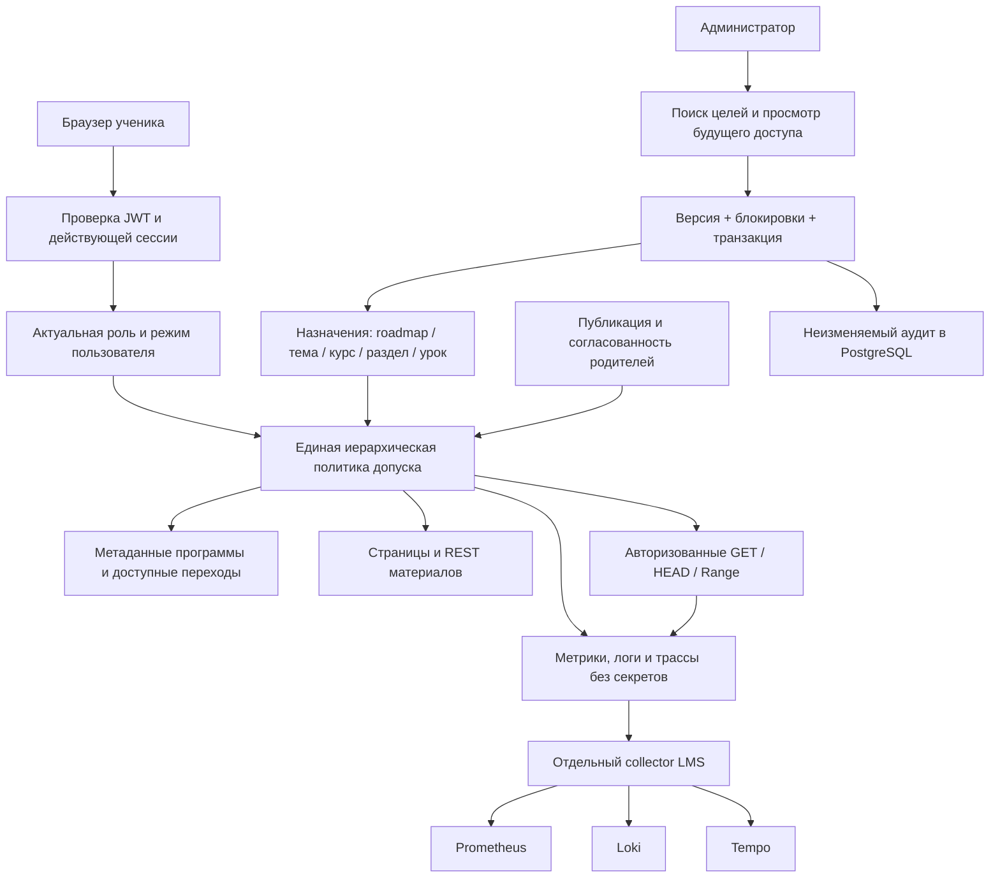

# Аудит учебного доступа — 8 октября 2026

Аудит охватывает ученика без назначений, ученика с частью программы, гостя,
администратора и ранее авторизованную сессию после отзыва доступа. Проверялись
страницы и RSC, Payload REST/Local API, прямые файлы и видео, пользовательские
заметки/прогресс, вложенные populate/select и конкурентные записи SDK.

## Архитектура

Роль и режим — отдельная независимая политика; форму Users SDK может
перезаписать, но решение допуска от неё не зависит. Отозванные сессии имеют
отдельные записи с SHA-256 идентификатора и сроком хранения. JWT strategy
получает документ после фильтрации отозванных сессий.

## Подтверждённые дефекты и исправления

| Дефект | Сценарий | Защита и проверка |
| --- | --- | --- |
| Формальная проверка наличия cookie на странице | Поддельная cookie открывала серверное чтение материала | Настоящая `payload.auth`, затем проверка урока до чтения content/description |
| Файлы обходили права урока | Прямой путь файла, thumbnail или orphan после угадывания имени | DB record + ссылки на уроки + текущий допуск, включая HEAD/Range; неподтверждённая обложка не делает материал публичным |
| Переносимая ссылка источника | Исходный Disk URL либо CDN redirect использовался отдельно от аккаунта | Ссылки источников не передаются ученику; поток и вложения проксируются через авторизованные маршруты |
| Чужие аккаунты и пользовательские документы | ID, depth, populate или переадресация владельца записи | Users admin/self, минимальная проекция лидерборда, owner hooks и право на фактический урок |
| Запись прогресса закрытого урока | PATCH старой заметки/прогресса после отзыва | Проверка текущего и нового урока до записи, начислений и побочных эффектов |
| Присвоение чужого аватара | Указание ID приватного файла | Только собственное небольшое растровое изображение; сервер задаёт uploadedBy |
| Устаревший PATCH возвращал доступ | Payload заполнял отсутствующие поля из старого originalDoc | Захват только явно переданных полей; повторное чтение под блокировкой; правдивый аудит |
| SDK возвращал прежние роль/режим | Параллельный login/logout записывал полную старую запись Users | Отдельная authoritative policy; роль проверяется до admin bypass |
| SDK восстанавливал завершённую сессию | Login другого устройства возвращал ранее удалённый SID | Независимый revocation marker в транзакции logout; фильтрация до JWT SID check |
| SDK возвращал прежний пароль | Login записывал прежние hash/salt после смены пароля | Узкая проекция session-only записи адаптера; актуальные credentials проверяются до выдачи JWT; reset/refresh сериализуются |
| Cookie CSRF через соседний домен | Пустой csrf allowlist SDK принимал любой Origin | Канонический serverURL/Origin; отдельные проверки Origin для изменяющих API; явный неверный JWT не заменяется cookie |
| Конкурентное редактирование назначений | Два администратора сохраняли разные версии | Optimistic revision, advisory lock и одна транзакция с аудитом; конфликт 409 |
| Утечка через наблюдаемость | URL с reset/source токеном, SQL или email уходил в span/log | Ограниченные атрибуты, redaction экспортёров, низкая кардинальность metric labels |

Отчёт описывает конкретные закрытые сценарии, а не гарантию отсутствия всех
возможных уязвимостей. Регрессии проверяются настоящим Payload и PostgreSQL,
включая приостановку конкурентной операции в воспроизводимой точке.

## Реальные границы защиты

- Разрешённый зритель получает байты видео: запись экрана и сохранение этих
  байтов технически возможны. Запрет кнопки скачивания не заменяет авторизацию.
- Старые публичные ссылки Яндекс.Диска остаются доступны людям, которым они
  уже известны. Их окончательное закрытие требует переноса на приватное
  хранилище и отключения публичных публикаций после проверки переноса.
- Отзыв проверяется на следующем запросе. Уже открытая передача может закончиться;
  ранее полученные файлы невозможно отозвать.
- Лимиты потоков сейчас действуют на процесс. При нескольких репликах нужен
  общий limiter, например Redis. Политика прав и аудит уже находятся в PostgreSQL.
- Collector имеет ограниченную память и очередь. При длительном отказе backend
  часть телеметрии теряется; учебные операции продолжаются, аудит сохраняется в БД.
- После назначения закрытого доступа нельзя откатывать приложение на старую
  версию, игнорирующую назначения: нужен исправленный образ с той же политикой.
  Полный schema down удаляет сами назначения и не является способом отката прав.

## Проверяемые артефакты

Модель и алгоритм: [learning-access.md](./learning-access.md).
Метрики, backend, правила и каналы: [learning-observability.md](./learning-observability.md).
Граница видео/файлов: [video-access.md](./video-access.md).

Интеграционные сценарии: `learningAccess`, `learningAccessConcurrency`,
`learningAccessManagement`, `learningMediaAccess`, `lessonVideoAccess`,
`authSession`, `contentWorkflows` и существующая матрица CMS/access/schema.
Браузерные сценарии: `learning-access-management`, `auth`, `learning-resume`.
Миграции дополнительно проверены на копии только схемы production с двумя
локальными legacy-аккаунтами; реальные данные учеников не копировались.
